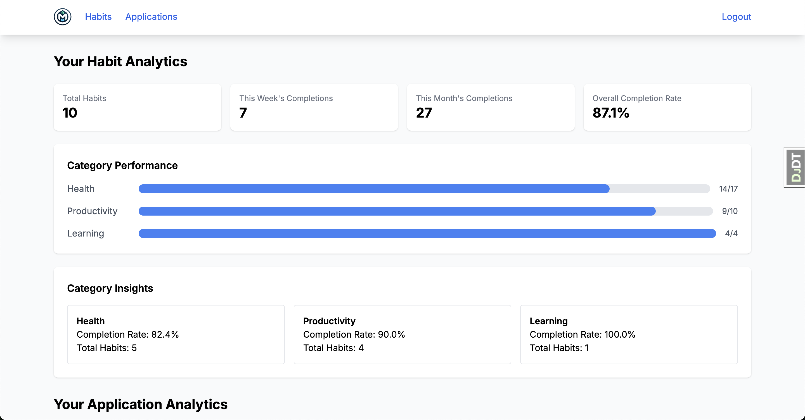
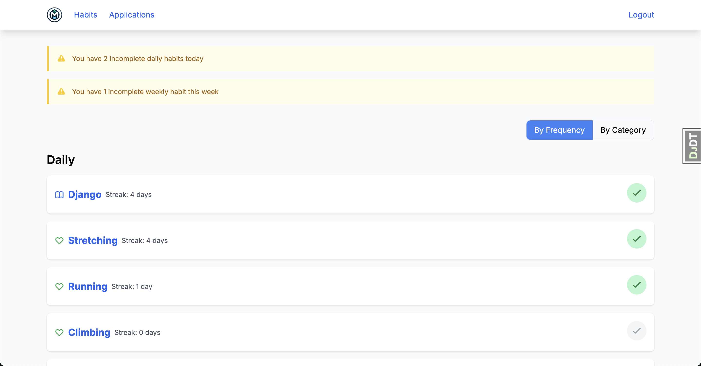
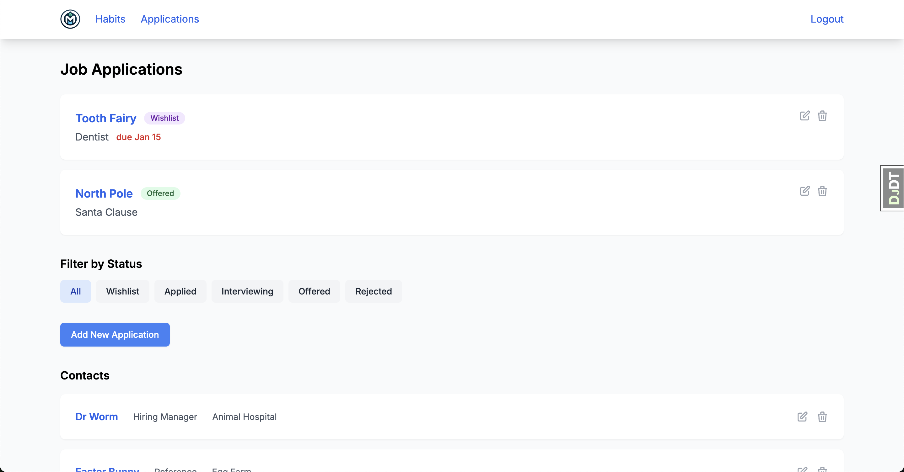
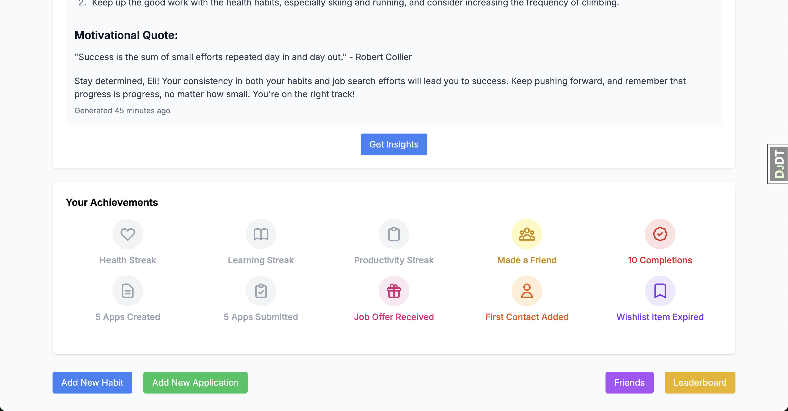

# Momentum - Habit & Job Search Tracker

A Django-based application that helps users build positive habits while managing their job search process. Combines habit tracking with job application management in a clean, modern interface.



## Features

### Habit Tracking
- Create and manage daily/weekly habits across different categories (Health, Learning, Productivity)
- Track completion streaks and view progress over time
- Earn badges for maintaining streaks (7-day, 30-day milestones)
- AI-powered insights about your habit patterns
- Visual progress indicators and streak counters



### Job Application Management
- Track job applications from wishlist to offer stage
- Store application details, deadlines, and interview notes
- Manage professional contacts (recruiters, hiring managers, references)
- Track application status changes over time
- Analytics dashboard showing application pipeline
- Automated badges for job search milestones



### Social Features
- Connect with friends to view their habit dashboards
- Leaderboard rankings based on streak consistency
- Achievement badges for various milestones
- Share progress and motivate each other



### Technical Features
- Clean, responsive UI built with Tailwind CSS
- Google OAuth integration for easy sign-in
- OpenAI integration for habit insights
- Comprehensive test coverage
- Mobile-friendly design

## Technology Stack

- **Backend**: Django 5.1.5
- **Frontend**: Tailwind CSS
- **Database**: Postgres
- **Authentication**: Google OAuth
- **AI Integration**: OpenAI API
- **Testing**: Pytest
- **Task Runner**: Honcho

## Setup

1. Clone the repository
   ```bash
   git clone https://github.com/yourusername/momentum.git
   cd momentum
   ```

2. Create a virtual environment:
   ```bash
   python -m venv env
   source env/bin/activate  # On Windows: env\Scripts\activate
   ```

3. Install dependencies:
   ```bash
   pip install -r requirements.txt
   ```

4. Create a `.env` file with the following variables:
   ```
   DJANGO_SECRET_KEY=your_secret_key
   GOOGLE_CLIENT_ID=your_google_client_id
   GOOGLE_CLIENT_SECRET=your_google_client_secret
   OPENAI_API_KEY=your_openai_key
   ```

5. Run migrations:
   ```bash
   python manage.py migrate
   ```

6. Start the development server:
   ```bash
   honcho start
   ```

## Project Structure

- `habits/`: Main habit tracking functionality
- `applications/`: Job application management
- `social/`: Friend connections and social features
- `theme/`: Tailwind configuration and styling

## Development

- Follow PEP 8 style guide
- Write tests for new features
- Use class-based views for CRUD operations
- Maintain mobile-first responsive design
- Keep AI prompts in separate configuration files

## Testing

Run the test suite:
```bash
pytest
```

## Contributing

1. Fork the repository
2. Create a feature branch
3. Commit your changes
4. Push to the branch
5. Create a Pull Request
